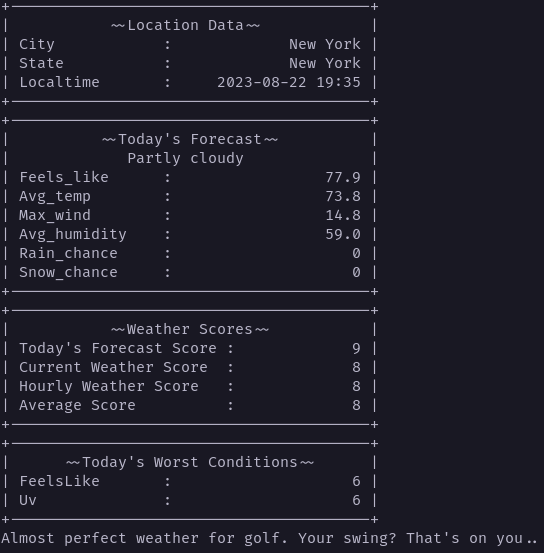

# Fore!Cast

## Description

Fetches the weather and let's you know whether you can go golfing or not.

Uses a provided location, or if no location is provided it defaults to IP
address geolocation. This default is not very accurate, and may get a city near
you but not your exact location.



### API Requirements

Requires a [WeatherAPI](https://www.weatherapi.com/) free tier key to use.

It will ask for your API key if it doesn't detect one in a .env file. The
provided key will be written to the `WEATHER_API_KEY` variable in a .env file
at the root of the project.

## Installing

This project was written in Python 3.10.7, so you must have at least Python
version 3.10.7 installed before proceeding.

You can check your current Python version with the command

```bash
python --version
```

Clone this project to a directory of your choice

```bash
git clone https://github.com/nronzel/forecast.git
```

Move into the cloned project directory

```bash
cd forecast
```

Run the program with

```bash
python main.py
```

You may need to run it using `python3` explicitly if you get errors with the
above command

```bash
python3 main.py
```

### How to Use

You will be prompted for an API key if none is found in the root project directory
in an .env file. The provided key will be written to a .env file under the variable
`WEATHER_API_KEY`. It will use this API key to load the fetcher to fetch the data.

A prompt will be printed to the console showing the weather forecast and a
message about if you should go golfing depending on the weather.

## How It Works

Scores are given to each weather condition on a scale of 1 - 10, with 10 being
the most favorable conditions and 1 being horrible conditions. These scores are
used to evaluate an overall score for the day and based on that overall score,
a response is printed out.

## Testing

You can run the current test suite with
```bash
python tests.py -v
```

## Future Features
- Specialized messages based on what weather conditions suck for the day

TODO:

- [x] ~~Input Sanitization for location & api key~~
- [ ] Finalize the output
- [ ] Revisit the phrases one more time and refine
- [ ] Refactor the current code as it is
